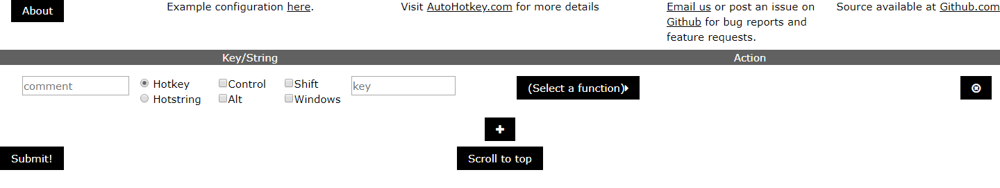
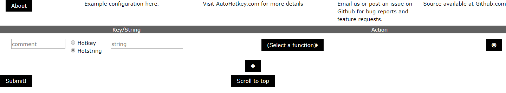
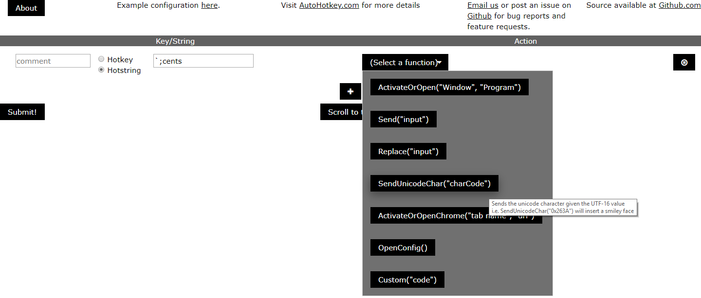
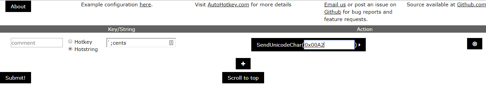
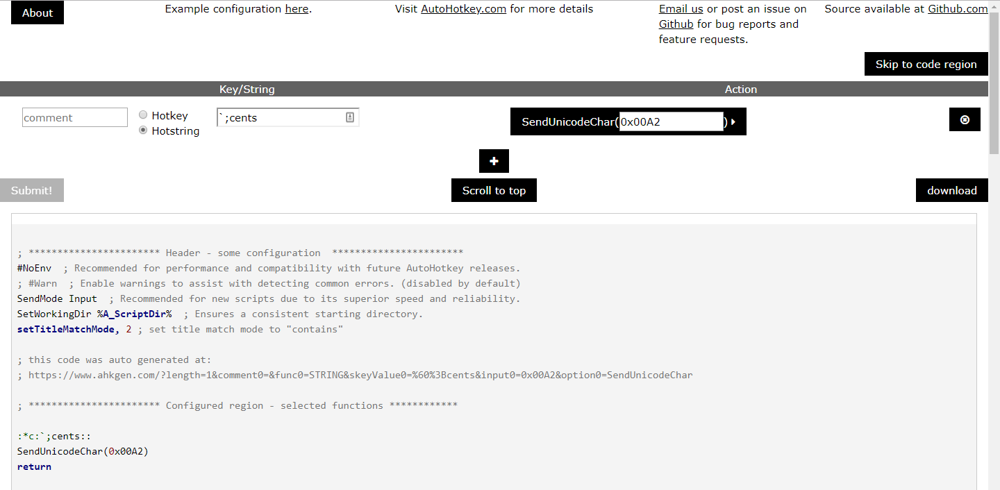
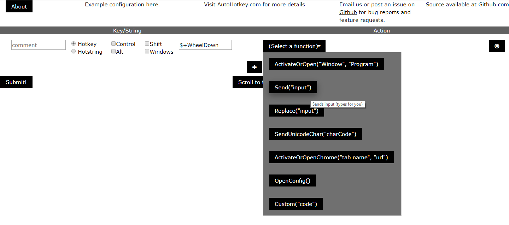
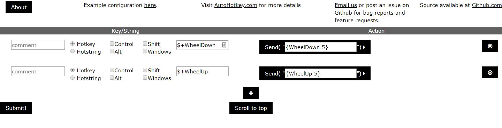
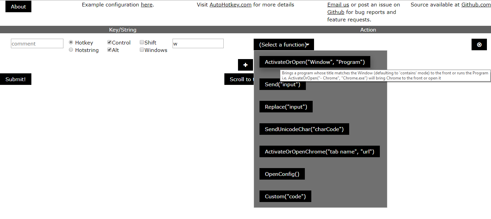
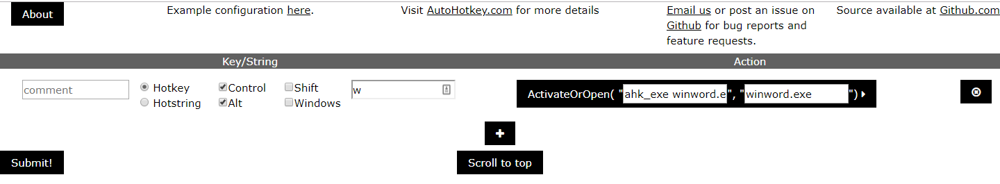

AutoHotkey ([AHK](http://autohotkey.com){:target="_blank"}) is a powerful scripting language initially intended for the creation of macros and keyboard shortcuts. With its powerful and simple syntax for key-binding and window management, it is a useful tool for any Windows user's tool belt.

## Background

I was first introduced to [AHK](http://autohotkey.com){:target="_blank"} by a coworker ([John](https://github.com/thesloopjohnb){:target="_blank"}) in the summer of 2014. I had been on the search for a way to store lines of text I had to type frequently that was better than a text file and copy/paste. That summer, I acquired a barcode scanner for a project, but also experimented with using it for this as well (I printed off a sheet of bar codes containing lines of code I kept needing to add to the work I was doing). John mentioned AHK to me, and I tried it out. 

I use it all the time now, with some shortcut scripts setup to run on startup, and the occasional "I need to do this thing real quick" when Python isn't the best option (For example, see my [Time Focuser](/Projects/TimeFocuser.html) article).

## Overview of Syntax

### A basic action that I'll use several times throughout this overview is typing out an expresion through the `Send` keyword.

This would type "e" and move to the next instruction

<pre>
<code class="autohotkey">
Send, e
</code>
</pre>

### To create hotkey (a set of keys hit at once), specify the keys followed by `::` then the desired action

This would type the letter "e" whenever "i" is hit.

<pre>
<code class="autohotkey">
i::Send, e
</code>
</pre>

### To create a hotstring (a set of characters typed in order to trigger an action), put `::` then the string followed by a `::`

To make it not matter where you type the string (you could even type it on the desktop while it beeps that you are giving it invalid input), use `:*c:` as the lead in set (putting a "*c" in the first pair of :'s)

When dealing with hotkeys, if you just put some text after the trigger, the action will be a replace (back space what you typed and send the other text)

This would replace any btw's with "by the way"s

<pre>
<code class="autohotkey">
:*c:btw::by the way
</code>
</pre>

### Simple, but let's go simpler

I hope you can see how easy it is to make a basic script, but the point of using AHK is to make difficult automation extremely easy.

Enter [AHKGen.com](http://www.ahkgen.com){:target="_blank"}.

## AHKGen.com Overview

From the site:

This is a generating configuration utility for AHK scripts

In order to run these scripts, one needs to either download and install Autohotkey from the main website or have someone who has an install compile the script.

This tool allows for a very quick editor for the most common basicu usages with AHK to help you get going.
  
### Example 1: Typing the '&#162;' symbol

Have you ever noticed how the 'Cents' symbol is never on your keyboard? Most of us have just learned to deal by typing "$0.05" instead of "5 &#162;" - Yes, I'm using html encoding for this blog post, but what I'm about to show you will work in any text editor that handles Unicode characters (which is just about everything except the basic Notepad). This is particularly useful when trying to make tidy/professional signs, flyers, or similar with prices in the cents range. 
 
However, realize that the following steps apply to most (if not all) unicode symbols, so if you find yourself needing to type check marks, smiling faces, or union symbols, head over to [fileformat.info](https://www.fileformat.info/info/unicode/){:target="_blank"} and look up the UTF-16 Hex value for whatever symbol you need to use in the steps below (although, I have found googling "unicode {symbol}" and selecting the [fileformat.info](https://www.fileformat.info/info/unicode/){:target="_blank"} link from the results to work better then using their search).

* Open [AHKGen.com](http://www.ahkgen.com){:target="_blank"}
  * By default, we're given a single blank configuration to start with
     
  
    
* Change the option to Hotstring
   
  
    
* Set the 'string' field to "\`;cents" (the '`' tells AHK to escape the ';' - otherwise that would be the start of a comment)
    
* Select the SendUnicodeChar function from the drop down
   
  
    
* Enter the value 0x00A2 in the parameter field
   
  
    
* Hit "Submit!" to have your code generated
   
  {:target="_blank"}
    
* You can now download your completed script, and if you have installed [AHK](http://autohotkey.com){:target="_blank"}, you can open it, go to a word doc (or something similar), and type ';cents' and watch it transform into a '&#162;' symbol.
    
  
### Example 2: Fast scrolling

Ever encounter a document or website where you wish your mouse scrolled a lot faster, but don't want to change the scroll setting because it's the right speed on smaller docs?

* Open [AHKGen.com](http://www.ahkgen.com){:target="_blank"}
  
    
* Keep the Hotkey option
    
* Set the 'key' field to "\`$+WheelDown"
  * The '$' tells AHK to only accept triggers for this hotkey from the actual keyboard (allowing us to not start an infinite loop)
  * The '+' is how you designate the shift key (while shift is an option that we can check, we need to provide the '$', so we provide it ourselves)
  * Finally, WheelDown means "When the mouse wheel goes down a click"
    
* Select the Send function from the drop down
   
  
    
* Enter the value "{WheelDown 5}" in the parameter field.
  This will tell AHK to send a WheelDown event five times each time you scroll down while holding Shift.
    
* Hit the "+" button to add another row and configure it the same as the first, except with WheelUp in place of the WheelDown's
   
  {:target="_blank"}
* Hit "Submit!" to have your code generated
    
* You can now download your completed script, run it, go to a really tall website (like Facebook or Wikipedia), and watch how much faster you scroll while you hold the shift key down versus while not holding it down.
    
  
### Example 3: Bringing Word to the front

Here's where the power of [AHK](http://autohotkey.com){:target="_blank"} really starts to shine through. I can create a shortcut to word on the desktop and use the properties to assign a "shortcut key" to open it, but with [Autohotkey](http://autohotkey.com){:target="_blank"}, I can have my macro be smart enough to bring it to the front if it is open, and open it if not.

There's a provided function for this on [AHKGen.com](http://www.ahkgen.com){:target="_blank"}, so we'll go ahead and use that to make Word come to the front if we hit CTRL + Alt + w.

* Open [AHKGen.com](http://www.ahkgen.com){:target="_blank"}
   
  
    
* Keep the Hotkey option
    
* Set the 'key' field to "\`w" (notice the lower case, this is case sensitive) and select Control and Alt
    
* Select the ActivateOrOpen option
   
  
    
* This method has two parameters - the window to search for, and the program to open if not found.
  * Set the Window to "ahk_exe winword.exe" - this tells AHK to look for a program belonging the the winword executable (the EXE that Word is stored as -- at least as of the 2010-2016 era of Office).
  * Set the Program to "winword.exe"
    
* Hit "Submit!" to have your code generated
   
  {:target="_blank"}
    
* You can now download your completed script, run it, (close all Word windows) hit CTRL + Alt + w, and see it open. 
   
  Bring some other windows on top of it (your browsers, email, etc), hit CTRL + Alt + w again, and see it pop to the front - ready for action!
    
  
### More examples!

All of these examples and more are included in the [example configuration available on AHKGen.com](https://www.ahkgen.com/defaultconfig.html){:target="_blank"}

  
## Other resources:

For more examples of great ideas to automate using AHK, check out these other articles (Note that these articles were mostly written before the existence of [AHKGen.com](https://www.ahkgen.com){:target="_blank"}, so fail to mention it) :

* [How-To Geek: How to write an AutoHotkey Script](https://www.howtogeek.com/409581/how-to-write-an-autohotkey-script/){:target="_blank"}
* [How-To Geek: The Beginner's Guid to Using an AutoHotkey Script](https://www.howtogeek.com/56481/the-beginners-guide-to-using-an-autohotkey-script/){:target="_blank"}
* [How-To Geek: How to Create Custom Keyboard Shortcuts with AutoHotkey](https://www.howtogeek.com/290501/how-to-create-custom-keyboard-shortcuts-with-autohotkey/){:target="_blank"}
* [MakeTechEasier: 10 Favorite AutoHotkeyScripts to Make Life Easier](https://www.maketecheasier.com/favorite-autohotkey-scripts/){:target="_blank"}
* [Make Use Of: 10+ Cool AutoHotkey Scripts & How to Make Your Own](https://www.makeuseof.com/tag/10-cool-autohotkey-scripts-make/){:target="_blank"}

  

## Some Final Notes:
* If you have [AHK](http://autohotkey.com){:target="_blank"} installed, you can run the scripts by opening them (you can also compile them to make them portable if you desire)
* I have found it useful to put my main script (with my set of hotkeys/strings I use often) in my [Windows startup folder](https://www.howtogeek.com/228467/how-to-make-a-program-run-at-startup-on-any-computer/){:target="_blank"}
* Even though we wrote seperate scripts in the examples above, it is fine to write one main script

  
## Call for comments
On this article in particular, I'm interested in hearing what scripts/macros you've found to be useful and are willing to share.
