## Why Bother?

Making a bunch of backups just means making a bunch of copies of old pictures and files that I don’t know if I’ll ever need again. Some even go so far as to say that pictures are for those who can’t remember.

It also seems like a lot of hassle to go through to make a bunch of copies of documents that I never look at.

But, what would happen if you were to lose those documents and pictures? If it’s something worth keeping, it’s something worth making sure you will still have when things go wrong.

### Side Note:

You want to backup the things that it would be a problem (or a loss) if they disappeared (things like family pictures, work, important documents). You don’t need a bunch of backups of large files that you can easily regain (like a digital music library downloaded from your favorite store  or downloaded movies that you expect to be able to download again).

## How?

Let’s say for a moment that you make a copy of all your files to a thumb drive once a week, every week, for years. Now what happens if your computer crashes? You would still have last week’s versions of the files on the thumb drive.

But what if your thumb drive is lost or inaccessible? Suppose your laptop crashes on your way to give a presentation and you lose all your files, and your thumb drive backup is at home. What if the thumb drive becomes corrupted the same week your computer crashes?

One of the best solutions to this is to also use an online backup like Google Drive, OneDrive, DropBox, or even Apple Cloud or similar service. The chances of you being in a situation where your original files are gone, you can’t get to your thumb drive, and you can’t access the internet are pretty small.

You might say that you would just use the internet backup, and that is fine as long as any time you need to access it you have internet available (and can sign in), but there’s always the possibility of your account being hacked and your files deleted (despite the efforts that online backup  companies put in to making sure your account doesn’t get hacked, ultimately the only one responsible to make sure your files are preserved is you). In any of these scenarios, if you had your thumb drive, you’d be fine.

On the other hand, what if you forgot to take your thumb drive out of your pocket so it went through the wash, your internet is down, and your computer is not loading the latest version of the file? I recognize that the probability of this is fairly low, but you can still safeguard yourself against this by having more backups.
Or what if you need to access a version of a file from more than a week ago? Again, multiple backups would help with this, especially if you had a different system that you backed up to monthly.

### How many backups is enough?

I would encourage you to use three or more different types of backups. A backup to another folder on the same computer is one; a backup to a thumb drive, external hard drive, or CD-ROM is a second one; and an online backup is a third one.
My father is so adamant that he does not want to lose the family photos that I maintain a backup for him in a completely different geo-location. These files can be recovered in the case of his computer dying, his online backup account getting hacked and that version being deleted, and a fire at his house destroying the external hard drive he makes backups on (because I have a backup on another hard drive in another state). That might be a little more than is necessary; I live by the rule of at least three.

Regardless of how many primary backups you use, if the thumb drive your using starts having issues or you find out that your online backup service is having financial trouble, you should not count it as a backup any more. It’s time to get a new one. 
To put this in other words, if you see any indication that your hard drive, your offline backup, or your online backup are going away, replace it. For instance, if the online backup your using is going through financial trouble, it’s time to start using another one. You don’t have to migrate everything, but make a copy.

### When in doubt, back it up again.

### Side Note:
Often, when I am trying to figure out how to do something new on my computer, the first place I check is HowToGeek.com. They have a couple of good articles on how to make backups for you computer as well (featuring different methods than the one presented here). I would encourage you to also check our their articles if you feel like either want more information, or want to know about more methods/programs that make backups easy.

<a href="https://www.howtogeek.com/242428/whats-the-best-way-to-back-up-my-computer/" target="_blank">HTG: What’s the best way to backup my computer</a>

<a href="https://www.howtogeek.com/howto/30173/what-files-should-you-backup-on-your-windows-pc/" target="_blank">HTG: Which files should I backup?</a>

<a href="https://www.howtogeek.com/347545/whats-the-best-online-backup-service/" target="_blank">HTG: What’s the best online backup system?</a>

## How to make backups effortlessly

### Keeping it simple
 
Once a week, consistently, go to my C:\Users\{your username}, select all the folders (CTRL + A will do this), and copy the files to the backup location (this works well with a thumb drive or external hard drive).

If you want a setup to make this happen automatically

1. Open Notepad
2. Copy the following line to the file

    <code>xcopy %~dp0\* “{destination folder}” /DIYRK</code>

    (replace the {destination folder} with the acutal folder you want to backup to - keep the quotes)
3. Save it as CopyFiles.bat

Now, whenever you double click on the file, it will copy all the files from the directory it is in to the folder that you specified. The flags at the end (/DIYRK) tell your computer to:

* /D - copy only files that are newer than in the destination
* I - Copy whole folders
* Y - replace files when copying
* R - overwrite read-only files (copy everything)
* K - copy attributes (keep all the info about when you created it and such).

### Using an online backup

Pick one, go through its setup instructions, and make sure it is setup to sync regularly.

### Using a tool

A tool I've been for a little while to help make backups easier is <a href="https://freefilesync.org/" target="_blank">Free File Sync</a> (FFS). This tool allows for setting up a script with more control than batch scripts do and is available on all computer OS’s (so if you’re not using Windows, you can still use this).

When you first open the software, it has a couple of options.
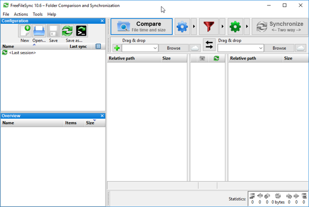{:class="screenshot center"}

 
Open your documents folder (or whatever folder you want to back up)
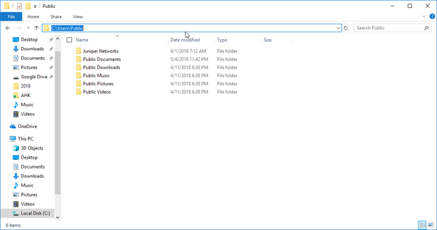{:class="screenshot center"}

 
Copy from the address bar into FFS on the Compare side:
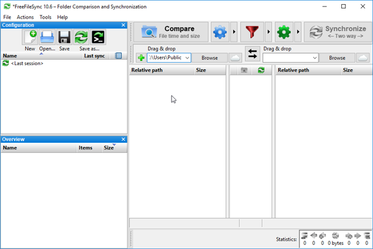{:class="screenshot center"}

 
Then either do the same for the destination (on the synchronize side), or hit the browse button:
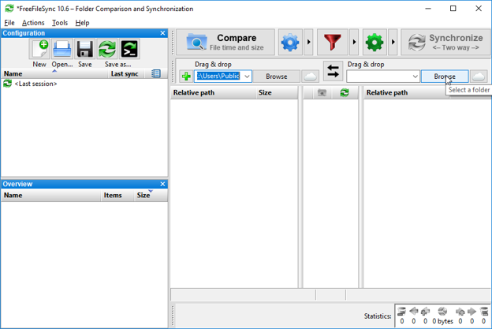{:class="screenshot center"}

 
Select the blue gear to configure how you would like to have it compare the two files.
By default it is set to file time and size. This allows it to detect if a file has been changed (contents), or if it is newer than the backup copy. This will most likely be what we want.
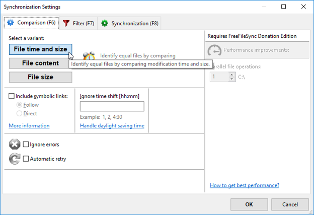{:class="screenshot center"}

 
Select the Synchronization tab to edit what files are copied

If you want a backup that is an exact copy of what was in the source folder, then select “Mirror ->”
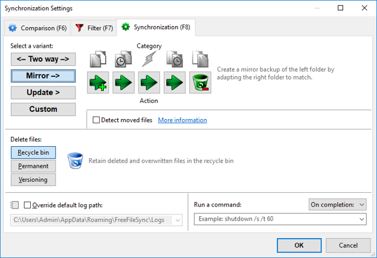{:class="screenshot center"}

Going from left to right, you can hover over the icons to see what they mean.
* If the file exists on the left (the source directory) only, then then copy it to the right (the destination folder).
* If the file exists on the left (the source directory) only, then then copy it to the right (the destination folder).
* If there are changes in both the original and the backup, copy over the backup.
* If the file is newer in the backup, overwrite it with what is currently in the original.
* Lastly, if the file does not exist in the source, but exists in the backup, go ahead and delete it.

This is a good option for monthly backups where you really want to just save the state at the moment in time.

A second option is to use the Update mode:
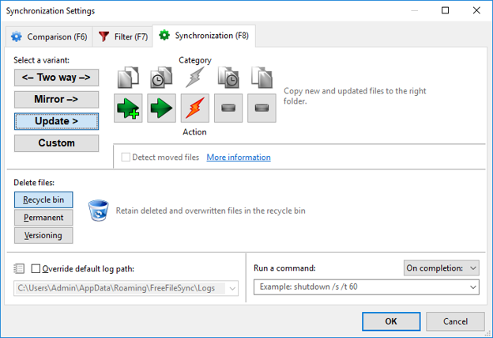{:class="screenshot center"}
Here, 
* if the file is new or has a newer edit in the source directory, it gets copied. 
* If there are changes to both the source and the backup, FFS will ask you how to resolve the conflict, 
* and files that have a newer version in the backup or that have been deleted from the source but not the backup are left alone. 

This is a good option if you want to make sure to have the latest version of any file in your backup, and want to be able to clear space off of your main computer without having it get deleted from your backups. Use this option for weekly backups.

Once the settings have been configured, click the Compare button. This will give you a preview of what the backup will do. 
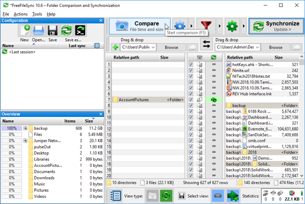{:class="screenshot center"}

(Since this is the first time I’ve run these two folders (and I just picked two random folders), there are a lot of differences.)
At this point, if you're happy with what files are going to be copied, you can hit Synchronize to update the backup folder.

To save this configuration, hit the black Floppy disk (Save button) on the left. This will save it as a configuration that you can re-open later. (Personally, I also go ahead and hit the black button over the “Save as…” which lets me save this configuration as a script that I can double click to run on a weekly basis. This is called a “Batch Job”. It has a few options)
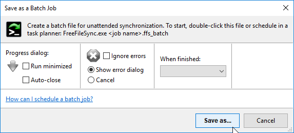{:class="screenshot center"}

I tend to set mine up like this, it means that when this runs, I’ll have a small dialogue with the status, and after it has finished, I’ll either have a window I can address errors in, or a confirmation that the backup ran successfully and how many files were copied, or whatever, and I would encourage you to do the same.

### Making it run automatically

Wouldn’t it be nice if you could wakup up on Saturday morning and when you go to check your email there’s a little dialogue that says the backup completed successfully? Having this on a regular basis can help you remember that you have backups when something goes wrong, and in a case where you are using FFS, you know you now have a backup copy that is ready to be put on your external hard drive.

After setting up FFS like in the above section and using the option to save a “Batch Job”, you can use the Window Task Scheduler (If your using Linux, you should look into Crontab) to schedule the script to run regularly. 

To do this:
1. Open the start menu and search for Task Scheduler
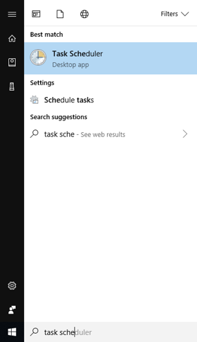{:class="screenshot center"}

1. Open it

1. Select "Create Basic Task"
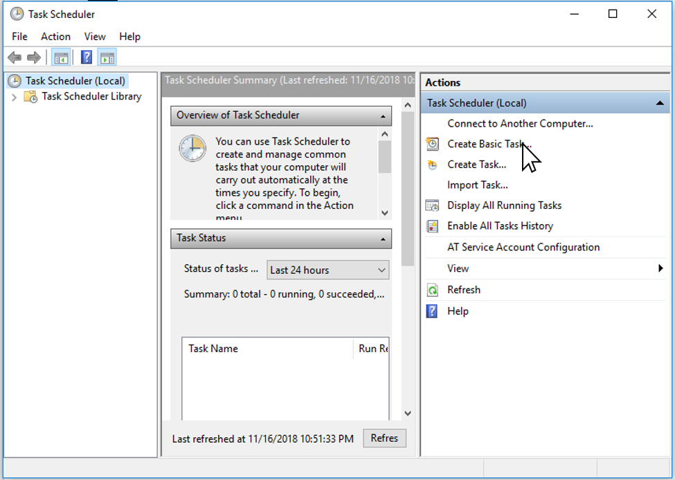{:class="screenshot center"}

1. In the dialog that opens, name the new task something descriptive like “backup my documents folder” and click next
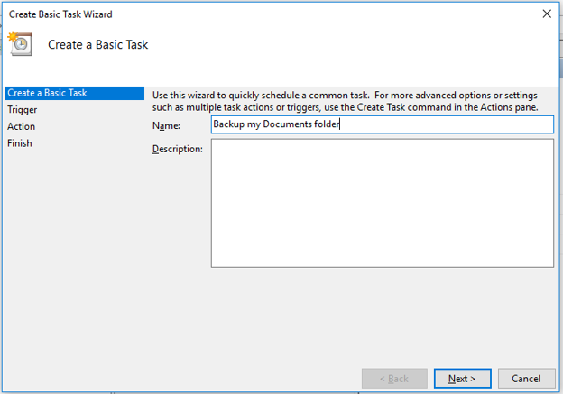{:class="screenshot center"}

1. For trigger, select how often you would like it to run the backup. For this example, we'll select weekly (it does make a little bit of difference on the next step because daily just means every day, weekly it will prompt you what days, monthly it will prompt you what days of the month, etc.).
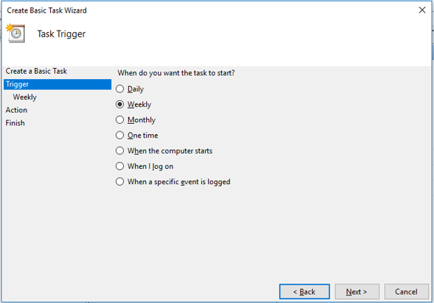{:class="screenshot center"}

1. If you selected weekly, select what day(s) of the week and what times. I would suggest like Saturday early in the mornint so your backups run well before you would be up so that when you do get up and go to check your email or something, it has already finished and you just have the dialogue telling you how it went.
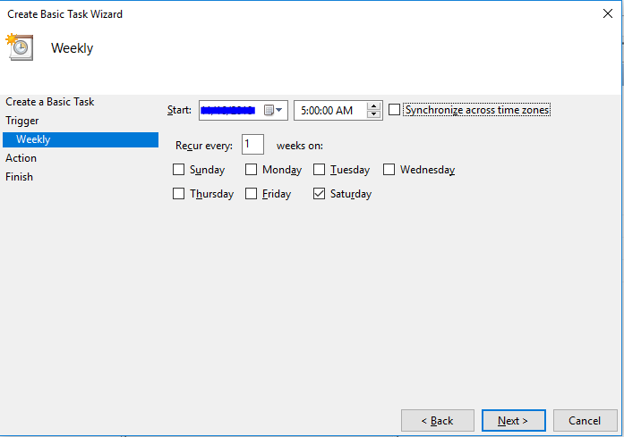{:class="screenshot center"}
(it will default to today for the start date which is fine).
 
 

1. For action, select “Start a program” and click next
{:class="screenshot center"}

1. On the next screen, you will specify what “program” to run, click browse and locate where you saved the batch job from FFS.
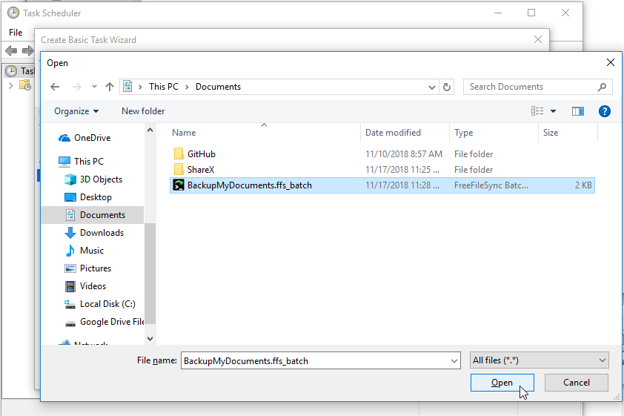{:class="screenshot center"}
You don’t need to worry about the other two fields, so click next.
 
 

1. On the last screen, double check everything looks right, select the “Open the Properties dialog . . .” check box and click finish.
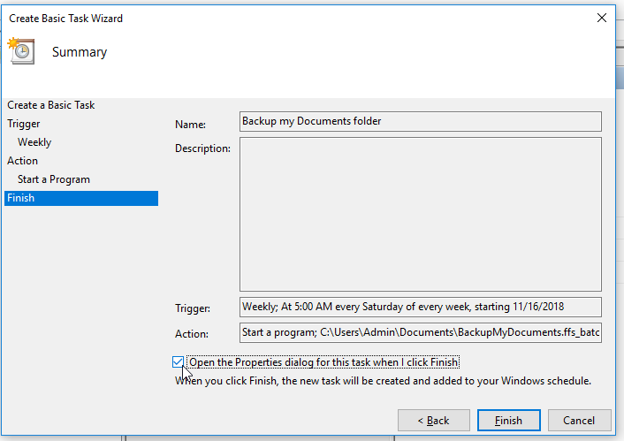{:class="screenshot center"}

1. We will use the properties dialogue to set the task to wake your computer to run this task only if it is plugged in (that way as long as you leave your computer charging on Friday night, it will run the backup Saturday morning and be ready for you when you wake up).
First, change the option to “Run whether user is logged in or not” and check the “do not store password”
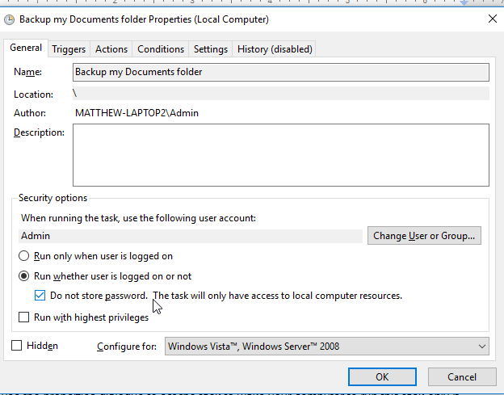{:class="screenshot center"}
The other default settings here work fine.
 
 

1. Select the Conditions tab, and check the box that says to “Wake the computer to run this task”
{:class="screenshot center"}

1. Select "OK"

Congratulations, you have now set up your computer to wake up (if plugged in) and make a backup of your files. 

### Making tweaks:

To tweak how the backup works, go to the backup script, right click on it, and select “Edit wit Free File Sync”:
{:class="screenshot center"}
This will re-open the configuration dialogue where you can change how the comparison is done, and whether or not files are copied under different scenarios (see above for description - also see FSS documentation [https://freefilesync.org/tutorials.php] )

To change how often or when the backup runs,
* Open Task Scheduler (I find the easiest way is to open the start menu and search “Task Schedule”) and scroll down till you can see the “Active Tasks” region
{:class="screenshot center"}

* In there, scroll to the backup task you created (I called mine “Backup my Documents folder”, so here is why descriptive names are important).
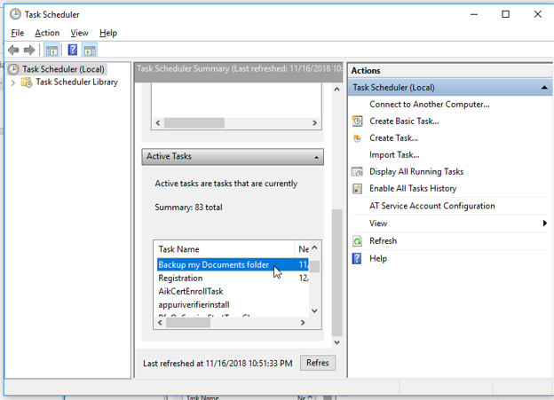{:class="screenshot center"}

* Double click on it to see the details on it.
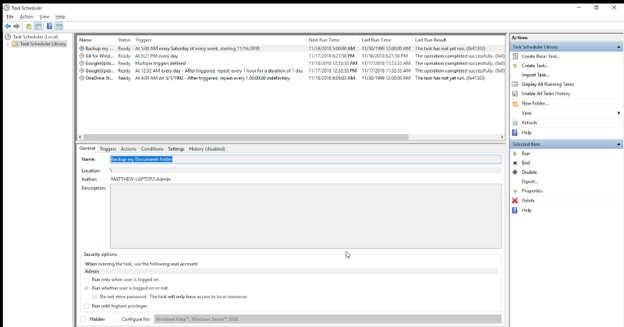{:class="screenshot center"}

* And select the properties option on the right:
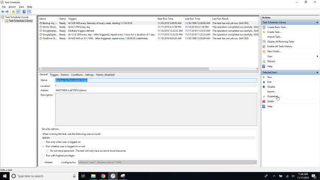{:class="screenshot center"}

* This will re-open the edit dialogue where you can change the triggers, conditions, and even the Actions (what program it runs).

### This is an overview on how to setup automatic backups to a local folder.

One advantage to this method is that the dialogue can be used as a reminder that you should get out the thumb drive or external hard drive and copy the backup that was just made to it.

This tutorial **intentionally** does not go into a lot of detail on all the features of online backup systems, FFS, or even Task Scheduler; however, if you feel a detail is missing, please either [let me know](/contact) or comment below.

