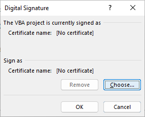

# Background

I'm a Software Developer. I write tools to solve problems. I've thought about "what if someone takes a tool I put on the internet changes it to inject a virus, then passes it off as my original?".
At the same time, Windows is trying harder and harder to make running un-trusted code difficult (and with good reason).

These two factors sent me down the rabbit trail of "ok, digitally signing would make it clear if my program was changed, but how do I sign something and how do I make it so that Windows can be told to trust things that I've signed?"

Below is a recap of the "how" that I learned:

# Step 0: Setting up your own root CA.

You can *technically* skip this step, but having a certificate that you use to sign the other certs allows you to just distribute this cert and ask users to install it as trusted (on the basis that they trust you - see section below [What does installing a root certificate mean?](#what-does-installing-a-root-certificate-mean)).

In PowerShell, this can be accomplished with:

```powershell
$yourRootName="..." # replace the ... with a unique name
$rootCertParams = @{
    Type = 'Custom'
    Subject = "CN=${yourRootName}CA"
    KeySpec = 'Signature'
    KeyExportPolicy = 'Exportable'
    KeyUsage = 'CertSign'
    KeyUsageProperty = 'Sign'
    KeyLength = 2048
    NotAfter = (Get-Date).AddYears(5) # you can make this longer or shorter. I've seen recommendations to not have it be over 2 years, and I've seen people make it 10. I think that 5 is long enough that anyone using this should probably be getting an updated cert from me.
    HashAlgorithm = 'sha256'
    CertStoreLocation = 'Cert:\CurrentUser\My'
}
$rootCert = New-SelfSignedCertificate @rootCertParams
```

To share the cert (without the private key part), run:
```powershell
Export-Certificate -Cert $rootCert =Type CERT -FilePath "${yourRootName}.cer"
```

This will save out the public portion of your cert at the name specified by "..." in the previous step.

This file can be copied to other computers and installed as a "Trusted Root Certificate".

Also, when you come back to this and need another cert in future, you can retrieve your root cert object by doing:
```powershell
$yourRootName="..." # replace the ...
$rootCert = Get-ChildItem -Path Cert:\CurrentUser\My  | Where-Object { $_.Subject -eq "CN=${yourRootName}CA" }
```

To list all your currently available certs, run:
```powershell
Get-ChildItem -Path Cert:\CurrentUser\My | Select-Object { $_.Subject }
```

## What does installing a root certificate mean?

It means that you trust the author/holder of the cert to:
1. only publish code/tools signed with it that they have written or verified.
2. protect the private-key portion to prevent others from using it

**Installing a root certificate means that you trust the author/owner completely because any code they publish that is signed with that cert, will be allowed to run on your computer**

&#9888;&#x26A0; ONLY install root certificates from individuals or companies that you know and trust. &#9888;&#x26A0;

As such, by making a root cert (certificate authority) yourself, you are saying to anyone you share this cert with that you will do 1 & 2 so that they their trust in you (manifested by installing your cert as a root CA) is no misplaced.


# Part 1: Signing VBA files

## Step 1:

Load back in the root CA you created earlier:

```powershell
$yourRootName="..." # replace the ...
$rootCert = Get-ChildItem -Path Cert:\CurrentUser\My  | Where-Object { $_.Subject -eq "CN=${yourRootName}CA" }
```

## Step 2: 
(assuming this is a new project that should have its own cert)
Generate a cert <em>signed by your root CA</em> with this code
```powershell
$yourCertName="..." # replace the ... with a unique name for this cert
$certParams = @{
    Type = 'CodeSigningCert'
    Subject = "CN=${yourCertName}"
    KeySpec = 'Signature'
    KeyExportPolicy = 'Exportable'
    KeyUsage = 'DigitalSignature'
    KeyUsageProperty = 'Sign'
    KeyLength = 2048
    HashAlgorithm = 'sha256'
    Signer = $rootCert
    CertStoreLocation = 'Cert:\CurrentUser\My'
}
$cert = New-SelfSignedCertificate @certParams
```

1. Open the vba editor (edit the macro)
1. Select tools "tools" menu
1. Select "Digitial Signature" under that menu
1. In the dialogue that pop up, under "Sing as", click on "Choose"
  {:.img-fluid}
1. In the window that pops up after, select the certificate that you wish to use
1. Save and close the editor.

Moving forward, any edits of the macro file on this machine will still be signed by that cert.

# Part 2: Signing exe's and PowerShell scripts

And of course, the same constraints apply here. When you sign something, you are saying that you are willing to put your reputation behind it being safe (or at least not malicious). This comes with the benefit of making it easier for people to know they got a legitimate copy from you, but you should not go around signing random things. **Only sign things that you are actually able to say that you know it is safe to run**.

**Note**: The steps are the same whether the executable in question is a `.exe` file or a PowerShell script. So I will just refer to both as the "`file\to\sign.exe`".

## Step 1:

Load back in the root CA you created earlier:

```powershell
$yourRootName="..." # replace the ...
$rootCert = Get-ChildItem -Path Cert:\CurrentUser\My  | Where-Object { $_.Subject -eq "CN=${yourRootName}CA" }
```

## Step 2: 
(assuming this is a new project that should have its own cert)
Generate a cert <em>signed by your root CA</em> with this code
```powershell
$yourCertName="..." # replace the ... with a unique name for this cert
$certParams = @{
    Type = 'CodeSigningCert'
    Subject = "CN=${yourCertName}"
    KeySpec = 'Signature'
    KeyExportPolicy = 'Exportable'
    KeyUsage = 'DigitalSignature'
    KeyUsageProperty = 'Sign'
    KeyLength = 2048
    HashAlgorithm = 'sha256'
    Signer = $rootCert
    CertStoreLocation = 'Cert:\CurrentUser\My'
}
$cert = New-SelfSignedCertificate @certParams
```

## Step 2b:
if this is an old project that you're re-signing, retrieve the old cert with:

```powershell
$yourCertName="..." # replace the ...
$cert = Get-ChildItem -Path Cert:\CurrentUser\My  | Where-Object { $_.Subject -eq "CN=${yourCertName}" }
```

## Step 3:
Sign the exe:

```powershell
Set-AuthenticodeSignature '.\path\to\file\to\sign.exe' $cert
```
