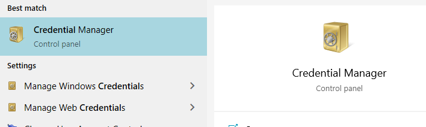
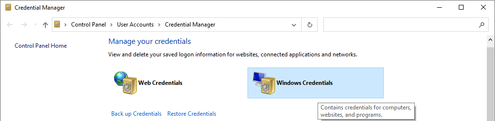

### Background

I use Microsoft Teams daily, but one day it stopped opening. When I told it to open, I got the loading dialogue, but it never progressed past that point. I used the web client for a while, but eventually tried to fix the local install.

### What I tried that didn't work
* rebooting
* re-installing

### Finding the solution [solved]
Hunting around on the [official support forum](https://answers.microsoft.com) I came across this thread: [Microsoft Teams will not start and stuck at "Loading Microsoft Teams..."](https://answers.microsoft.com/en-us/msteams/forum/all/microsoft-teams-will-not-start-and-stuck-at/3e95636f-499a-479b-8dcf-09e7bd21288e) where the poster said the proposed solution of deleting any and all "msteams*" credentials stored in Windows and re-launching had worked for them.

With this information, I un-installed the app again, and opened "Credential manager"(I searched for "credential" in my start menu)

I selected "Windows Credentials"

and scrolled down - clicking the down error then "remove" next to any entry that started with "msteams"

After this, I rebooted my computer, re-installed Microsoft Teams,  and was now able to open the desktop client (yay!).
