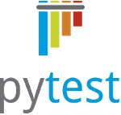

<b>Note: these are not in a particular order, but is a list top N list of useful tricks.</b>

* foo
{:toc}

For the duration of this document, the distinction between "unit", "system", and "integration" tests is not made - these rules and tips apply to all.

### 1. Do it.
{:class="pt-5"}

No "buts". No excuses. Write the tests.

> Software development without automated tests is like rock-climbing without a rope.
>
> \- T. Ousley

How true. 

While some like to "boulder" (that is, free climbing without a rope), they are limited in the height they can go safely - and so that is analogous to making a prototype.

### 2. Leave the system in the state you found it.
{:class="pt-5"}

You should be able to run your test suite over and over again and NOT have artifacts from one come into another and NOT have artifacts from your tests impact your deployment.

### 3. Write your tests first
{:class="pt-5"}

There's a couple of proverbs and methodologies about how to go about writing your software.

> Plan to throw one away; you will, anyhow.
>
>   \- Fred Brooks, The Mythical Man Month (1975)

This idea speaks to throwing together a quick and dirty prototype and improving on it (whether in pieces, or the whole thing), getting something together quickly helps to establish if what your trying to build is what is actually needed.

Another is:
> Get the requirements right first
>
>   \- over-quoted

This idea says that if you know exactly what to build, you'll build it right.

This has proven ineffective for large scale projects (See [Code Complete](https://www.amazon.com/Code-Complete-Practical-Handbook-Construction/dp/0735619670) and [Mythical Man Month](https://www.amazon.com/Mythical-Man-Month-Anniversary-Software-Engineering-ebook/dp/B00B8USS14/)).


Another is called:
> Iterative Development

The idea here to do a little feature mining, build out to those specs, test and validate, and repeat.
This concept comes from acknowledging that you will probably never be able to both (a) get all the requirements right before you start building and (b) if you get close, you've probably missed the window when the software would have been useful.

> Write the tests first
(more commonly known as TDD) borrows the good parts from all of these.

Like in iterative development, start with what you know, build a little, test, and build more.

Example:
> I know I need a method that take two numbers and adds them together

Your tests might look like:

```python
def test__add__3_4():
    assert add(3, 4) == 7

def test__add__5_8():
    assert add(5, 8) == 13
```

Cool. Go make the add method and make those tests pass.
Congratulations, that was your fist iteration.

(keeps working using new method)

> Oh, I need to handle negative numbers as if they weren't negative.

OK - that's a new requirement, add a test:

```python
@pytest.mark.parametrize("x,y,expected", [(1,2,3), (-1,2,3)])
def test__add__x_and_y__returns_expected(x,y, expected):
    assert add(x, y) == expected
```

Now go make that pass.

(note, see [# 5](#5-parametrize-your-tests) for an argument on using [`pytest.mark.parametrize`](https://docs.pytest.org/en/stable/parametrize.html))

At this point, you know that your method doesn't just need to do add - it does an absolute value add. So, rename the method.


Get to a point where your add implementation is just too hard to maintain? feel free to completely re-write it from scratch BECAUSE (if you've been writing your tests first), you know that once the tests pass again, it is functionally equivalent to the old version (meets all your specs).

Writing our tests first help us to:
* Break up additions to our software in small, incremental, verified changes (with each set of tests) - iterative dev.
* Define the requirements and high level API (that is, entry points and method signatures) before ever writing what it actually does - Getting the requirements documented first (for each small change)
* Give us a refactoring safety net - when the tests pass, all documented requirements are being met. - so we're free to "write one to throw away".

### 3. Use [Pytest](pytest.org)
{:class="pt-5"}

{:class="logo"}

In their own words:

> pytest: helps you write better programs
>
> The pytest framework makes it easy to write small tests, yet scales to support complex functional testing for applications and libraries.

Most of the tips in this list, I will go into details on why. For this one - it's most of the rest of these tips.


### 5. Parametrize your tests
{:class="pt-5"}

You want your tests to handle a variety of inputs, right?

Take advantage of the [`pytest.mark.parametrize`](https://docs.pytest.org/en/stable/parametrize.html) decorator (note: in Python, we have a syntactical sugar for adding info to methods and classes that we call `decorators` while these CAN implement the [decorator design pattern](https://www.tutorialspoint.com/design_pattern/decorator_pattern.htm), they often times do not)

This decorator gives you an easy ability to write test for many cases (just add another case to the parametrize list)


### 6. Use a consistent naming scheme
{:class="pt-5"}

(I'm going to suggest one, but Python's rule of [consistency](https://www.python.org/dev/peps/pep-0008/#a-foolish-consistency-is-the-hobgoblin-of-little-minds) also applies)

In a method (class, etc.) the information about what it's doing should be obvious from the name.

Consider using a variant on [Roy Osherove's Naming Standards for unit tests](https://osherove.com/blog/2005/4/3/naming-standards-for-unit-tests.html) (he assumes classes, and no other requirements, so we have to slightly tweak these for pytest styled tests.)

pytest requires  test names to start with [`test_`](https://docs.pytest.org/en/stable/goodpractices.html#test-discovery) (OK, works with by default but is configurable), and [PEP8](https://www.python.org/dev/peps/pep-0008/#function-and-variable-names) states that functions/methods (and variables) should be `snake_case_named` (that is, all lower-case and underscores (`_`) to separate words).

Suggestion: `test__{method under test}__{state under test}__{expected behavior}()`

Example:
testing an `add` method -> `test__add__3_and_4__returns_7()`
This is a concise, easily parse-able name that shows *what* is getting tested (the add method), what it's being given (3 and 4), and what it's expected to do (return 7).

If we slightly tweak this, we can say that this tests works for any given `x` and `y`:
```python
@pytest.mark.parametrize("x,y,expected", (
    (1,2,3),
    (3,4,7),
))
def test__add__x_and_y__returns_expected(x,y,expected):
    assert add(x, y) == expected
```

This scheme even works when testing error conditions:
```
def test__first_grade_add__negative_numbers__raises():
   with pytest.raises(NotEnoughSchoolingException):
       first_grade_add(-1, -1)
```

(see pytest's docs for testing exceptions including data on the raised exception: [docs.pytest.org/assert.html#assertions-about-expected-exceptions](//docs.pytest.org/assert.html#assertions-about-expected-exceptions))

### 7. Use a coverage utility (and keep it high!)
{:class="pt-5"}

[`pytest-cov`](https://pypi.org/project/pytest-cov/) is a pytest plug-in that adds coverage to your test runs.
([docs](https://readthedocs.org/projects/pytest-cov/en/latest))

You can tell pytest to always run with coverage for your module/project (or a specific module/folder) in your pytest configuration. (if using `pyproject.toml`, it might look like this):
```toml
[tool.pytest.ini_options]
addopts = "--cov=. --cov-report html" 
```
This tells pytest to run coverage on the working directory and generate an html report. (lots of options available, [read the docs](https://readthedocs.org/projects/pytest-cov/en/latest))

### 8. Use the Arrange-Act-Assert pattern to break up your tests
{:class="pt-5"}

Break your tests up into three sections ([separated by a single blank line](https://www.python.org/dev/peps/pep-0008/#blank-lines)).

`Arrange` - the setup for the test, what needs to be in place for the method to check what you want it to?

`Act` - the method under test

`Assert` - verify the results

Note: 
* Some tests won't need and `Arrange` because the test is able to operate in any environment (e.g., `add`),
* and some tests don't need an `Assert` because `pytest` implicitly asserts that the method under test doesn't throw (if this is the case, consider commenting in the assert region that it's an implicit no-throw assertion, or naming your test well ☺)


### 9. A test should have ONE and ONLY ONE reason to fail
{:class="pt-5"}

This means:
* only one assert
* only one method under test

In short - keep it short.

### 10. Mock external dependencies
{:class="pt-5"}

Don't have your tests be dependent on external servers, the file system meeting certain expectations, etc.

Side Note: What about `integration tests`?
> The overwhelming majority of your tests should be of your flow given an input.
>
> Spend some time (maybe a few tests) verifying that your external players (e.g. a web server, another module, etc.) give you what you expect in certain situations, but focus the majority of your time on how you handle what comes back:
>
> * Have I handled invalid data?
> * Have I handled no response?
> * What if they don't have data to give me, what does that look like?
>
> \- write tests that each of these cases (and any others that fit your situation) and then right a few tests that they give you the anticipated data.

**For file systems**:
{:class="pt-3"}

pytest provides a couple of built-in [fixtures](https://docs.pytest.org/en/stable/tmpdir.html?highlight=tmp_path#temporary-directories-and-files) for dealing with this (`tmp_path` is preferred).

`tmp_path` provides an instance of [pathlib2/pathlib](https://docs.python.org/3/library/pathlib.html) - producing OS agnostic easy file manipulation methods.

Testing a method that reads a file and parses it?

```python

data = """\
; this is an ini file
[region1]
key = "value"

global = "value2"
"""

def test__parser__example_file__parses_without_error(tmp_path):
    example_file = tmp_path / "example_config.ini"
    example_file.write_text(data)

    parser(example_file)  # if parser HAS to have it be a str, could use `str(example_file)` to get a OS specific path string
```

**For other dependencies**
{:class="pt-3"}

Your tests shouldn't fail because the network went down (OK, sometimes you want to test that you can get real data coming from the server and it matches what you expect. It's OK to have maybe 10% of the tests do this, but NONE of the tests about how you handle/parse the response need real time data ☺).

An easy way to solve this is via the [`unittest.mock`](https://docs.python.org/3/library/unittest.mock.html) module.

Conveniently, [`pytest-mock`](https://pypi.org/project/pytest-mock/) wraps this up in a fixture (`mocker`) for use in pytests.

Example:

```python
import requests

@pytest.fixture()
def mock_requests(mocker):
    mock = mocker.patch("requests.get")
    yield mock.return_value

def test__config_loader__response_from_server__parses_without_error(mock_requests):
    mock_requests.json.return_value = "{}"
    config_loader = ConfigLoader('localhost') # calls mocked requests.get and pulls the json from the result

    config_loader.parse_response()

    # implicitly assert a no-throw
```

(this has the effect of patching just for the duration of the test method using the fixture - so you can drop it on some tests and not on others easily)


### 11. Use snap-shot tests for comparing long strings or generated files
{:class="pt-5"}

A snapshot is a file (or part of a file) that is saved to disk (added to your source control - you're using Git, right?) and used to test against the output of the method that generated it over time.


Using snap-shots for output from methods provides:
* Saving example outputs to disk to examine
* If the method changes, the snapshot is updated (automatically with a flag to the tester) to match the new output
* A diff in the code review (or commit) that updated the test and the snapshots of how the change affects the output


There are competing modules for this:
* [snapshottest](https://pypi.org/project/snapshottest/) - similar to the snapshot testing in Jest, automatically puts saved outputs as strings into its own `.snap` file
* [pytest-snapshot](https://pypi.org/project/pytest-snapshot/) - expects you to tell it what directory and filename to use for the snapshot.

These are a little different in usage, `pytest-snapshot` has the advantage of saving files with file extensions so IDE's can open and render with syntax highlighting, while `snapshottest` saves the hassle of setting up test directories.

### 11. Use [`freezegun`](https://github.com/spulec/freezegun) for testing when times are involved
{:class="pt-5"}

`unittest.mock` won't let you patch some built-ins, and unfortunately, `datetime` is one of them.
There are ways to do it - but they they're generally either ugly or involve having every use go through your own wrapper (which you then mock).

[`freezegun`](https://github.com/spulec/freezegun) Takes all that away and provides a clean interface for mocking what date and time it is for your tests.


## Books:
Some books that helped me to learn these lessons (on the software engineering and importance of tests side of things) include:

* [Code Complete](https://www.amazon.com/Code-Complete-Practical-Handbook-Construction/dp/0735619670)
* [Mythical Man Month](https://www.amazon.com/Mythical-Man-Month-Anniversary-Software-Engineering-ebook/dp/B00B8USS14/)
* [Clean Code](https://www.amazon.com/Clean-Code-Handbook-Software-Craftsmanship/dp/0132350882)


## Other?

I try to always use these when writing Python code, but are there other rules/tips I should add too? (please tell me in the comments)
