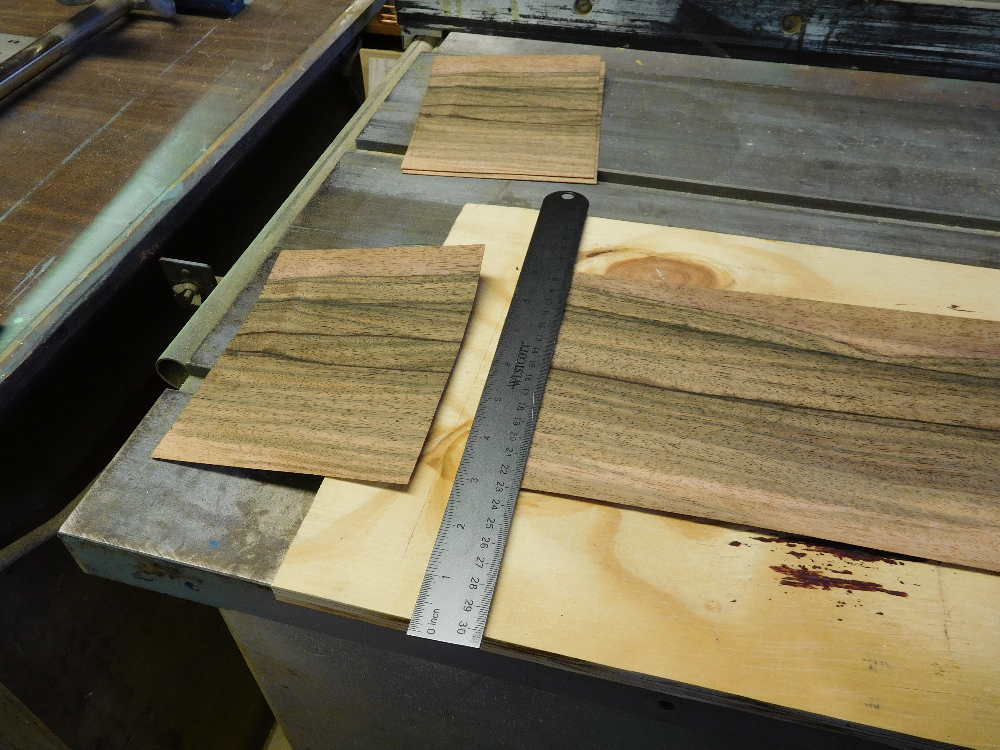
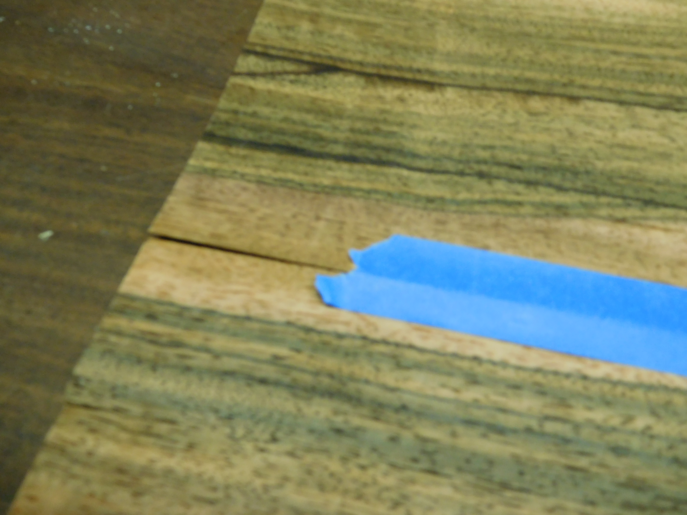

Complete part list at end of article: [Complete parts list](#complete-parts-list-including-wood-glues-case-io-etc)

{:.img-fluid}

## Background
My wife and I started spending some of our leisure time playing computer games together (co-op mode). However, the laptop we were using was not purchased with gaming in mind, so we went cheap and got equipment that can run Chrome and office and a few other things fine, but not really keep up well with even a light game.

This project was to build a custom computer (putting my time into assembly rather than paying someone else, in order to get more computer for the same budget). Sounds simple, right? Well ... the best place for it to fit was the bottom shelf of a book case in our living room. With the space measuring 27" wide by 12" deep by 6" tall, most conventional computer cases would not fit.

One option was to go with a compact of some form (whether that be a mini-ATX or ITX or similar), but I wanted this build to be a computer that we could upgrade as desired without completely rebuilding it. 

(Computer board sizes for reference)

{:.table}
| Motherboard size | Dimensions | Max RAM (GB) | M.2 slots | PCIe 16x expansion slots | Price | Board used for reference                                                                                                                          |
|------------------|------------|--------------|-----------|---------------------|-------|---------------------------------------------------------------------------------------------------------------------------------------------------|
| ATX              | 12”x9.6”   | 64           | 2         | 2                   | $74.98 | [ASRock B450 ATX AM4](https://pcpartpicker.com/product/PCKcCJ/asrock-b450-pro4-atx-am4-motherboard-b450-pro4)                                     |
| Micro ATX        | 9.6”x9.6”  | 32           | 1         | 1                   | $53.99 | [Gygabyte GA-A320M-S2H](https://pcpartpicker.com/product/sL7v6h/gigabyte-ga-a320m-s2h-micro-atx-am4-motherboard-ga-a320m-s2h)                     |
| Mini ITX         | 6.7”x6.7”  | 32           | 1         | 1                   | $96.71 | [Asus Prime H310I-PLUS R2.0](https://pcpartpicker.com/product/Lqvbt6/asus-prime-h310i-plus-r20csm-mini-itx-lga1151-motherboard-h310i-plus-r20csm) |

The availability of M.2 slots (roughly 6x the read speed of SATA), PCIe 16x slots (for graphics cards, or even faster SSD's), and the ability to put lots of RAM in made me want to figure out a way to make an ATX board work.

Just as I was starting to think, "What if I just built a case like [DIY Perks](https://www.youtube.com/watch?v=K8hLXJUQFoc&ab_channel=DIYPerks) did?", [Evan and Katelyn posted their own custom case build](https://www.youtube.com/watch?v=3-tHgu1si9I&ab_channel=EvanAndKatelyn). After we discussed the difference between the custom build I was thinking of versus the prebuilt fan-less we could get for less, we decided to go for the custom build - with a custom case that would both the space both dimensionally and aesthetically.

## Step 1: Plan the build

Requirements were:
1. $500 budget
1. Fit in the desired space
1. Have support for a potential future graphics card
1. Emphasis on quiet operation (so, using an SSD)
1. Have more ram than the current laptop (with a lot of room to expand preferred)
1. Quad core processer
1. Have built-in good WiFi as the space we want to use it in does not have access to ethernet (or a good way to get it there)

I had hoped to be able to fit an M.2 drive into the budget (and a lot more RAM), but I chose to go with the motherboard that would allow these, and go with less ram and a cheaper (and slower) SSD for now.

With these in mind, I spec'd out a system on [pcpartpicker.com](https://pcpartpicker.com/b/YFykcf).

My plan was to get some hard wood (maybe black walnut; I've seen some pieces made out of this that look great), and build a box. 

For airflow, I wanted to allow small gaps on the sides and use fans to draw fresh air in with passive exhaust out the front (because the back of the case is the space in the back of the book case, I wanted to not vent there at all).

## Step 2: Change to veneer

Once the electronics were ordered (black friday sales), I started looking to get my hands on some nice wood. I spoke to my mentor on this project about it, and he told me where he liked to get his but encouraged me to go with a cheaper and softer wood and veneer it because the nicer woods would not only be significantly more expensive but also much harder to work with.

Heeding his advice, I found this veneer: [Flat Cut Ebony Macassar Veneer](https://www.veneersupplies.com/products/Flat-Cut-Ebony-Macassar-Veneer-Lot--575-x-5975-3-Sheets-Per-Lot.html)
and picked up some 1/2" sanded plywood from my local hardware store. Based on the research I did, I learned that I should use plywood or mdf which are "dimensionally stable" and veneer both sides - known as balancing - to prevent the glue and veneer on one side of the board from warping it.

I ordered by *surface area* enough to coat all sides twice, and waited for parts to get in.

## Step 3: Realize it's tighter than expected

Once I had the motherboard, power supply, and SSD in hand, I laid them out on the plywood I had purchased. The motherboard was not laid out the way I thought it was from the docs (it was wider than it was deep). This meant that I didn't have the space I thought I had for mounting the SSD horizontally (using a 3.5" to 2.5" converter tray) if I still wanted to leave room for a graphics card (using a 1070 for reference dimensions).

I chose to mount the SSD vertically by attaching it to angle brackets, and this mostly solved my spacing issues - there was still less than 1" of space in front of the motherboard for any cables and potential exit fans.

## Step 4: Rip the plywood.

This is pretty straight forward (assuming one is familiar with the tools and can follow their own measurements and marking).

I needed a top and bottom measuring 12" × 27", a front and back measuring 27" x 5" (height driven by the 120mm fans I decided on), and two sides measuring 11" × 5".

> ### Lesson 1: Measure, diagram, measure, and make good notes
>
> When I laid out my pieces and decided on an *interior* of 11" × 26", I noted that my 1/2" plywood would eat up an inch in each direction. However, I wrote down my top pieces as 11" x 27" (notice, I only added an inch in one direction), and the walls as 11" long and 27" long. I noticed this discrepancy when I started cutting, but decided it was the other way around and cut my walls down to match the smaller dimension of the top and bottom.

## Step 5: Veneer

> ### Lesson 2: Surface area does NOT equal cut area
>
> Because I ordered veneer based on covering the surface area of the boards, when I went to lay my veneer out and figure out how to cut it down, I found that my options were to not veneer the whole thing, or have the back be assembled out of many small pieces left over from cutting down the stock pieces. We chose to leave the back not veneered, as it should effectively never be visible.

Using a utility knife and a metal straight-edge, I cut the veneer to the length. 

{:.img-fluid}

Any seams (like for the top and bottom where the board was wider than a single strip of veneer), I joined with masking tape.

{:.img-fluid}

I learned from my mentor that it would probably be ok to veneer only one side of the bottom **for now**, given that I planned to come back and do the other side later. So I left the under side of the bottom board for the time being.

With all pieces cut, joined, glued, and pressed down (to prevent bubbles), I stacked the various pieces with scrap wood and wax paper between the layers to prevent sticking to each other and clamped the whole assembly and let it sit (overnight would probably have been long enough, but I had to leave it for a week due to other projects).

{:.img-fluid}

Once the veneer was dry, I unclamped it, and used a utility knife to cut away the excess (which I later used for edge-banding).

## Step 6: Make holes for fans and venting

Here my plan was simple: use a hole saw to cut out the holes. Two problems arose immediately:
    
1. My mentor on this project couldn't find (and suspects he got rid of) his hole saw kit
2. Hole saw kits are EXPENSIVE. I bought a cheap one (~$20), hoping it would make it through the 4 cuts for the two sizes that I needed.

With the cheap hole saw kit, I set to cutting the 4" holes in the sides to let the 120mm fans draw air in. I quickly learned that this does not work well with veneering.

> ### Lesson 3: 
>
> Veneer tends to rip rather than cut unless a good high speed cutter (like a router) is used.

So, 1/8" into my first (of four) holes, I stopped and switched to drilling a template in a piece of scrap plywood to use in guiding a router instead.

By the time I completed the 4" template, it was apparent that my hole saw kit would not make it through very many holes anyway. I had to coax it through the 3" and 4" template holes I did cut, and the mounting setup was warped enough after each that I had to use a mallet to disassemble it.

## Step 7: Mark and drill holes for motherboard mount

Using the marking template from [DIY Perks](https://www.youtube.com/watch?v=K8hLXJUQFoc&ab_channel=DIYPerks) ([template files](http://bit.ly/2nB2cm0)) to mark the holes (with some tape to keep it in place), I used a punch and hammer to make marks in the veneered plywood.

The threaded inserts I used ([Amazon link](https://www.amazon.com/gp/product/B015CAPTZI/)) - but now am pretty sure I don't like because they didn't want to go straight and pulled up my veneer - provided a drill bit for this. I just put it in the drill press at my mentor's shop, set the depth, and drilled them out.

## Step 8: Assemble box

Because the option for future upgrades is a primary goal of this build, I opted to have the front and sides attached to the bottom, but to have the back attach only to the sides with 4 screws that would be accessible. This way, adding a slot for a gpu or other expansion cards would be easy (4 screws, mark, cut, re-attach with the 4 screws).

## Step 9: Realize the mistake made three weeks ago

{:.img-fluid}

At this point, I realized that the interior of my box was 10"; this is a problem as the motherboard is just shy of 10" (see [Lesson 1](#lesson-1-measure-diagram-measure-and-make-good-notes)). With a quick test fit, I saw that my build would still *just* work for the motherboard, and if I placed the PSU pointing to vent into the back, I could fit it as well (yes, this is a deviation from the original plan for airflow; the alternative was starting all over on the box).

{:.img-fluid}

## Step 10: Veneer the underside of the bottom board

{:.img-fluid})

## Step 11: Cleanup edges

Once the veneer was dry, I used a heat activated glue and an iron to apply edge-banding (using the parts I had trimmed away previously). Once this was done, I used a table router with a flush trim bit to clean up the edges by cutting the veneer to match up with the wood.

{:.img-fluid}

## Step 12: Test components outside box on bench-top to make sure they work

This is something that should always be done with a custom build because it is easier to debug issues with everything spread out and accessible then after everything is compiled into a case (this is one of the few corners I didn't try to cut on this project and I'm glad I didn't because I did have issues with getting it to boot once assembled, but I was able to be confident it wasn't that I had received bad hardware - turned out to be a loose cable).

## Step 13: Move components into box

Pretty straight forward and went smoothly for me (minus the cable that came loose).

## Step 14: Add "case i/o"

For this project, I decided that I needed to include a power button, a few USB ports, and front panel audio in case we wanted to plug in headphones or speakers temporarily (vs using the HDMI audio or a more permanent connection in the back).

I used a basic LED power button ([Amazon link](https://www.amazon.com/gp/product/B07PPDHKDT)), a 3.5" tray with USB3.0 and audio breakout ( [Amazon link](https://www.amazon.com/gp/product/B01A5DGJQA)), and decided to also add a motherboard speaker in case of any beep codes while booting ([Amazon link](https://www.amazon.com/gp/product/B01MR1A4NV/)).

## Complete parts list (including wood glues, case i/o, etc.):

{:.table}
| Selection                                                                                                                                                                                       | Base     | Total    |
|-------------------------------------------------------------------------------------------------------------------------------------------------------------------------------------------------|----------|----------|
| [AMD Ryzen 5 3400G 3.7 GHz Quad-Core Processor](https://pcpartpicker.com/product/XP6qqs/amd-ryzen-5-3400g-37-ghz-quad-core-processor-ryzen-5-3400g) | $227.99  | $227.99  |
| [Gigabyte B450 AORUS PRO WIFI (rev. 1.0) ATX AM4 Motherboard](https://pcpartpicker.com/product/43BTwP/gigabyte-b450-aorus-pro-wifi-rev-10-atx-am4-motherboard-b450-aorus-pro-wifi-rev-10) | $119.99  | $119.99  |
| [OLOy 16 GB (2 x 8 GB) DDR4-3000 CL16 Memory](https://pcpartpicker.com/product/smGnTW/oloy-16-gb-2-x-8-gb-ddr4-3000-cl16-memory-md4u083016bgda) | $63.99   | $63.99   |
| [Samsung 860 Evo 500 GB 2.5" Solid State Drive](https://pcpartpicker.com/product/6yKcCJ/samsung-860-evo-500gb-25-solid-state-drive-mz-76e500bam) | $54.99   | $54.99   |
| [Cooler Master R4-S2S-124K-GP 44.73 CFM 120 mm Fans 4-Pack](https://pcpartpicker.com/product/L8DwrH/cooler-master-r4-s2s-124k-gp-4473-cfm-120-mm-fans-r4-s2s-124k-gp) | $16.98   | $16.98   |
| [Athena Power AP-U1ATX40P8 1U EPS 80 PLUS Server Power Supply](https://pcpartpicker.com/product/r4H48d/athena-power-ap-u1atx40p8-1u-eps-80-plus-server-power-supply) | $72.99   | $72.99   |
| [ThreeBulls 5 Pack 4-Pin PWM Fan Splitter Cable, Sleeved Braided Adapter Computer PC Fan Power Extension Cable Converter for Computer ATX Case 4-Pin/3-Pin Cooling Fan Cable (10.6")](https://pcpartpicker.com/product/TzfFf7/threebulls-5-pack-4-pin-pwm-fan-splitter-cable-sleeved-braided-adapter-computer-pc-fan-power-extension-cable-converter-for-computer-atx-case-4-pin3-pin-cooling-fan-cable-106) | $7.99    | $7.99    |
| [E-SDS USB 3.0 2-Port 3.5 Inch Front Panel USB Hub with 1 HD Audio Output Port/1 Microphone Input Port/1 USB 3.1 Type C Port for Desktop [ 20 Pin Connector &Audio Connector &2ft Adapter Cable]](https://www.amazon.com/gp/product/B01A5DGJQA) | $23.59   | $23.59   |
| [Cylewet 10Pcs Mainboard Computer PC Internal Speaker Buzzer Computer Case Buzzer for Arduino (Pack of 10) CYT1027](https://www.amazon.com/gp/product/B01MR1A4NV) | $6.99    | $6.99    |
| [NOYITO 16mm Chassis Switch Metal Button Switch with 22inchs Extension Cable Red Yellow Blue Green Switch Symbol Suitable for Computer DIY Switch (16mm, Blue Symbol)](https://www.amazon.com/gp/product/B07PPDHKDT) | $10.50   | $10.50   |
| [E-Z LOK 400-M3 Threaded Inserts for Wood, Installation Kit, Brass, Includes M3-0.5 Knife Thread Inserts (10), Drill, Installation Tool](https://www.amazon.com/gp/product/B015CAPTZI) | $14.50   | $14.50   |
| [Titebond 3703 Cross-Linking Polyvinyl Acetate Dark Wood Glue, 8 Oz, Bottle, Light, Liquid, 8 Ounce, Brown](https://www.amazon.com/dp/B001DT5IPO) | $4.76    | $4.76    |
| [Flat Cut Ebony (Macassar) Veneer Lot](https://www.veneersupplies.com/products/Flat-Cut-Ebony-Macassar-Veneer-Lot--575-x-5975-3-Sheets-Per-Lot.html) | $29.35   | $58.70     |
| [Better Bond Heat-Lock™ Veneer Glue](https://www.veneersupplies.com/products/Better-Bond-Heat-Lock-Veneer-Glue.html) | $15.95 | $15.95   |
| |          |          |
| Total:                                                                                                                                                                                          |          | $699.91  |

## Things I would do differently:

* When I noticed a discrepancy in my notes about board sizes, I should have re-consulted my notes on dimensions and what sizes pieces were - that would have saved me the headache of figuring out how to make the project still work, and allowed me to keep the original plan of being able to add exit fans if needed.
* I chose to cut my boards to size, make the veneer slightly larger, glue it together, use a cutter to remove the excess once dried and re-use it for edge-banding. I learned in this project that I would have gotten much cleaner edges if I had cut the boards larger, veneered, and used a table saw to trim the boards (with the veneer) down to size.
* This project wound up taking much longer than expected, and cost more than if I had put it in a cheap standard case. If I were to do it again, I would put the computer in the standard case and use it while designing and building the custom case.

## Conclusion:

In the end, I've learned a lot about veneering, and like how that part of the project came out. The computer is running and is performing well.

With the 5 fans in total, it's not as quiet as I had hoped (although my wife says she can't hear it...), CPU temps seem to range from ambient (~86° F - 30° C) to quite warm for humans (~110° F - 43°C), but that is well within the [rated max temp of 203° F (95° C)](https://www.amd.com/en/products/apu/amd-ryzen-5-3400g#products-lift-slot).

This project blew the original &#36;500 budget - I had originally planned to use the AMD Ryzen 3, but it was out of stock and went with the 5 (added 20 dollars), and the veneer alone cost more than a cheap case (and more than I had thought I would spend on the wood ☹), but it was a learning experience and I now know to watch out for these gotchas next time I'm working on a project.
